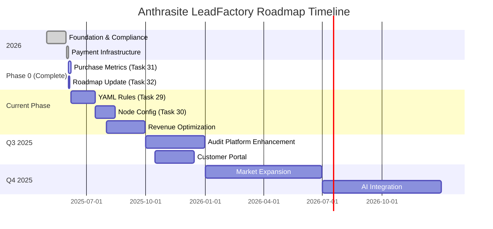

# Anthrasite LeadFactory Project Roadmap

## Table of Contents

1. [Executive Summary](#executive-summary)
2. [Business Model Evolution](#business-model-evolution)
3. [Completed: Phase 0 (v1.3) - Foundation & Compliance](#completed-phase-0-v13---foundation--compliance)
4. [Current Phase: Audit Business Optimization (June 2025)](#current-phase-audit-business-optimization-june-2025)
5. [Next Phase: Enhanced Audit Platform (Q3-Q4 2025)](#next-phase-enhanced-audit-platform-q3-q4-2025)
6. [Future Phases: Scale & Expansion (2026+)](#future-phases-scale--expansion-2026)
7. [Development Timeline & Milestones](#development-timeline--milestones)
8. [Strategic Priorities (2025-2026)](#strategic-priorities-2025-2026)
9. [Success Metrics & KPIs](#success-metrics--kpis)
10. [Risk Management](#risk-management)
11. [Implementation Methodology](#implementation-methodology)
12. [Conclusion](#conclusion)

---

## Executive Summary

The Anthrasite LeadFactory has successfully evolved from a lead generation pipeline into a comprehensive **audit-first business platform**. Our system now prioritizes direct revenue generation through audit services while maintaining lead generation capabilities as a secondary offering for agency partnerships.

## Business Model Evolution

### Current: Audit-First Revenue Model
- **Primary Revenue Stream**: Direct audit sales to businesses
- **Secondary Revenue Stream**: Lead generation services for partner agencies
- **Value Proposition**: Immediate website audits with actionable insights
- **Customer Journey**: Discovery → Audit Purchase → Implementation Support → Retention

### Key Business Metrics (As of June 2025)
- Purchase metrics tracking with Prometheus integration
- Customer Lifetime Value (CLV) calculations
- Conversion funnel analytics by audit type
- Revenue tracking with Stripe integration
- Financial reporting and profit margin analysis

## Completed: Phase 0 (v1.3) - Foundation & Compliance

### ✅ Core Infrastructure (May 2025)
- **Email Deliverability Hardening**: 2% bounce threshold, automatic IP rotation, spam tracking
- **CAN-SPAM Compliance**: Unsubscribe functionality, postal addresses, opt-out tracking
- **Metrics & Monitoring**: Prometheus integration, Grafana dashboards, cost-per-lead tracking
- **Raw Data Retention**: Compressed HTML storage, LLM logging, 90-day retention policy
- **Pre-commit Workflow**: Ruff, bandit, black integration with CI pipeline

### ✅ Payment & Revenue Infrastructure (June 2025)
- **Stripe Integration**: Payment processing, webhook handling, fee tracking
- **Financial Tracking**: Transaction logging, profit margin calculations, refund management
- **Purchase Metrics**: Real-time revenue analytics, CLI business intelligence tools
- **PDF Generation & Delivery**: Secure audit report generation and customer delivery
- **Storage & Security**: Supabase integration, access control, URL expiration
- **Email Integration**: SendGrid for transactional emails and delivery notifications
- **AI Processing**: GPT-4 for advanced content analysis and report generation
- **Python Infrastructure**: Full Python implementation with modern development practices

## Current Phase: Audit Business Optimization (June 2025)

### 🔄 In Progress
| Task | Priority | Status | Description |
|------|----------|---------|-------------|
| Task 31 | High | Validation Pending | Purchase Metrics Monitoring Layer |
| Task 32 | Medium | In Progress | Roadmap Documentation Update |

### 📋 Next Priority Tasks

| Task | Priority | Timeline | Focus Area |
|------|----------|----------|------------|
| Task 29 | **High** | Q3 2025 | Simplify YAML Scoring Rules |
| Task 30 | Medium | Q3 2025 | Update NodeCapability Defaults |

#### Task 29: Simplify YAML Scoring Rules 🎯
- **Objective**: Streamline scoring configuration for audit-focused criteria
- **Key Deliverables**:
  - Optimize for website quality, technical SEO, and user experience metrics
  - Reduce complexity while maintaining scoring accuracy
  - Audit-specific scoring templates
- **Timeline**: Q3 2025

#### Task 30: Update NodeCapability Defaults ⚙️
- **Objective**: Align node configuration with audit-first infrastructure needs
- **Key Deliverables**:
  - Optimize resource allocation for PDF generation and metrics collection
  - Enhanced monitoring and alerting capabilities
- **Timeline**: Q3 2025

## Next Phase: Enhanced Audit Platform (Q3-Q4 2025)

### Revenue Optimization & Analytics
- **Advanced Customer Segmentation**: Audit type performance analysis
- **Pricing Optimization**: Dynamic pricing based on audit complexity
- **Retention Strategies**: Follow-up services and subscription models
- **Competitive Analysis**: Market positioning and feature differentiation

### Technical Platform Enhancements
- **Web Interface for Audit Management**: Customer portal for audit access
- **Advanced Report Customization**: Industry-specific audit templates
- **Automated Follow-up Systems**: Post-audit engagement workflows
- **API Platform**: Third-party integrations for audit data

### Quality & Compliance
- **Audit Quality Assurance**: Automated validation of audit accuracy
- **Compliance Monitoring**: GDPR, CCPA, and industry-specific requirements
- **Security Enhancements**: Enhanced encryption and access controls
- **Performance Optimization**: Faster audit generation and delivery

## Future Phases: Scale & Expansion (2026+)

### Market Expansion
- **Multi-Industry Support**: Beyond HVAC, Plumbing, and Veterinary
- **Geographic Expansion**: International markets and localization
- **Enterprise Solutions**: Large business audit packages
- **White-label Platform**: Partner audit services

### Advanced Technology Integration
- **AI-Powered Insights**: Machine learning for audit recommendations
- **Predictive Analytics**: Business performance forecasting
- **Integration Ecosystem**: CRM, analytics, and marketing tool connections
- **Mobile Platform**: iOS/Android apps for audit management

## Development Timeline & Milestones

## Strategic Priorities (2025-2026)

### Revenue Focus
1. **Customer Acquisition Cost (CAC) Optimization**: Reduce acquisition costs through improved targeting
2. **Customer Lifetime Value (CLV) Maximization**: Increase retention and upsell opportunities
3. **Conversion Rate Optimization**: Improve audit sales funnel performance
4. **Market Expansion**: Scale to new verticals and geographic regions

### Technical Excellence
1. **Platform Reliability**: 99.9% uptime for audit generation and delivery
2. **Security & Compliance**: Industry-leading data protection standards
3. **Performance**: Sub-5-minute audit generation for standard reports
4. **Scalability**: Support for 10,000+ audits per month

### Business Intelligence
1. **Real-time Analytics**: Live dashboard for business performance
2. **Predictive Modeling**: Forecast revenue and customer behavior
3. **Competitive Intelligence**: Market analysis and positioning
4. **Customer Success Metrics**: Satisfaction, retention, and advocacy tracking

## Success Metrics & KPIs

### Financial Metrics
- Monthly Recurring Revenue (MRR) growth: Target 20% month-over-month
- Customer Acquisition Cost (CAC): Target sub-$50 per audit customer
- Customer Lifetime Value (CLV): Target $300+ per customer
- Gross profit margin: Target 85%+ for audit services

### Operational Metrics
- Audit delivery time: Target <24 hours from purchase
- Customer satisfaction: Target 4.5+ stars average rating
- Platform uptime: Target 99.9% availability
- Support response time: Target <2 hours for customer inquiries

### Technical Metrics
- API performance: Target <200ms response times
- Error rates: Target <0.1% for critical paths
- Security incidents: Target zero data breaches
- Code coverage: Target 90%+ test coverage

## Risk Management

### Technical Risks
- **API Dependencies**: Maintain fallback options for critical third-party services
- **Scaling Challenges**: Proactive monitoring and infrastructure planning
- **Security Threats**: Regular security audits and penetration testing

### Business Risks
- **Market Competition**: Continuous feature development and differentiation
- **Economic Downturns**: Flexible pricing and cost management
- **Regulatory Changes**: Compliance monitoring and legal review processes

## Implementation Methodology

### Development Approach
Our development methodology emphasizes iterative delivery with continuous validation. Each phase builds upon proven foundations while introducing new capabilities that directly support revenue generation and customer success.

### Quality Assurance
- **Comprehensive Testing**: Every feature includes unit, integration, and end-to-end tests
- **Performance Monitoring**: Real-time metrics and alerting for all critical systems
- **Security Audits**: Regular vulnerability assessments and compliance verification
- **Customer Feedback Integration**: Direct customer input drives feature prioritization

### Technology Stack Evolution
The platform leverages modern Python frameworks and cloud-native architectures to ensure scalability and reliability. Our technology choices prioritize developer productivity, system performance, and operational excellence.

### Competitive Differentiation
Unlike traditional SEO audit tools that provide static reports, our platform delivers actionable insights with direct implementation support. Our audit-first business model creates immediate value for customers while establishing long-term revenue relationships.

## Conclusion

The Anthrasite LeadFactory has successfully transformed into a revenue-generating audit platform with strong foundations in payment processing, metrics tracking, and customer delivery. Our roadmap prioritizes continued revenue optimization while maintaining the technical excellence that enables sustainable growth.

The shift to an audit-first business model positions us for sustainable profitability while preserving optionality for agency partnerships and lead generation services. Our focus on customer success, technical reliability, and business intelligence will drive continued growth through 2026 and beyond.

### Key Success Factors
1. **Revenue-First Mentality**: Every feature decision evaluated against direct revenue impact
2. **Customer-Centric Development**: Audit quality and delivery experience drive all technical decisions
3. **Scalable Architecture**: Platform designed to support 10x growth without architectural changes
4. **Data-Driven Optimization**: Comprehensive metrics enable continuous improvement and optimization

---

*Document created: May 21, 2025*
*Last updated: June 4, 2025*
*Business Model Updated: June 4, 2025 - Audit-First Revenue Model*
